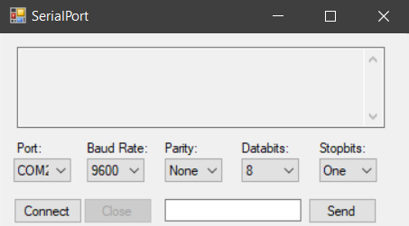
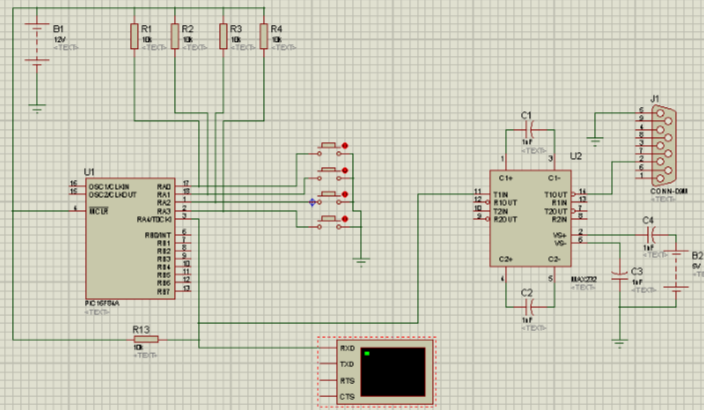

## Pic Driver

<!-- TABLE OF CONTENTS -->
## Table of Contents

* [About the Project](#about-the-project)
  * [Built With](#built-with)
* [Getting Started](#getting-started)
  * [Installation](#installation)
* [Testing Environment](#testing-environment)


<!-- ABOUT THE PROJECT -->
## About The Project
Console application that receives data sent from a PIC circuit, and according to the value it will either increase or decrease brightness/volume

### Built With

* [C#](https://docs.microsoft.com/en-us/dotnet/csharp/)
* [PIC16F84](https://www.boondog.com/tutorials/pic16F84/pic16f84.html)

<!-- GETTING STARTED -->
## Getting Started

To get a local copy up and running follow these simple steps.

### Installation
 
1. Clone the repo

```sh
https://github.com/metalsonic21/CA-Pic-Driver.git
```

<!-- USAGE EXAMPLES -->
## Testing Environment
1. Install [Virtual Serial Port Driver](https://www.virtual-serial-port.org/es/)
2. Download [the following C#](http://s000.tinyupload.com/?file_id=42623553392231652658) application to send messages through the serial COM 
3. Execute this application going to the following directory:

```sh
Pic_Driver/Pic_Driver/bin/Debug/Pic_Driver.exe
```
4. Open the .exe file and setup it like this and click on connect:



It's important that you select COM2 because the console application for the driver takes COM1

5. Now you can send any message to the console application, the accepted inputs are:
    a. **0**: Decrease Volume
    b. **1**: Increase Volume
    c. **2**: Increase Brightness
    d. **3**: Decrease Brightness

## Production Environment

1. The circuit used for this project is the following



The materials used were:

|**Quantity**|      **Item**           |
|------------|-------------------------|
|  1         |PIC16F84                 |
|  1         |MAX232                   |
|  1         |16 pin base              |
|  1         |18 pin base              |
|  1         |Quartz Crystal (4MHz)    |
|  2         |20pF condensor           |
|  4         |Buttons                  |
|  5         |10K Resistors            |
|  4         |10uF Tantalium condensors|
|  1         |DB9 Connector            |

2. Connect the circuit through RS232 COM1 in the PC
3. Use something like [MPLAB](https://www.microchip.com/mplab/compilers) to compile the .asm file and get a .asm to .hex conversion
4. Download and install [WinPic](https://www.winpic800.com) 
5. Use WinPic to set up the PIC microcontroller with the .hex file generated